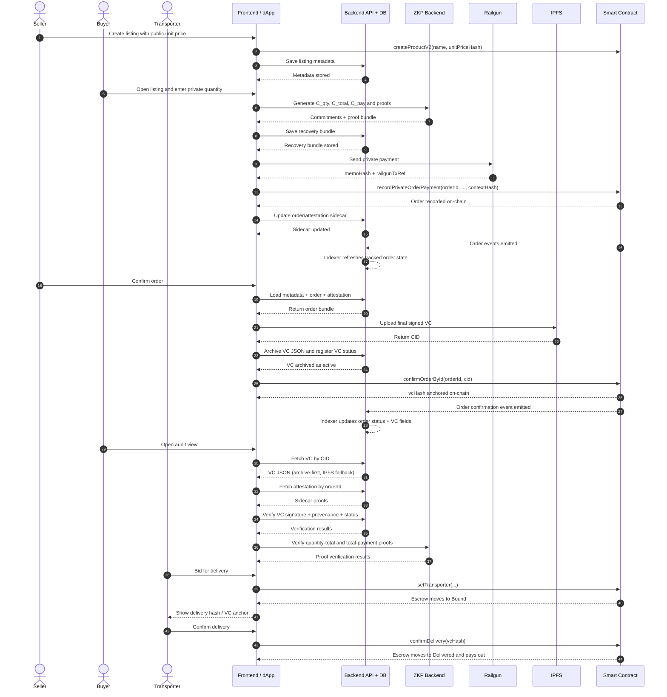

# End-to-End Flow (Current Implementation)

This document describes the active V2 order-based private-payment flow.
For DID signing and verification details, see `docs/current/04-did-signing-and-verification-standards.md`.

## Scope
- Network: Sepolia
- Contracts: `ProductFactory.sol` + `ProductEscrow_Initializer.sol`
- UI flow: listing -> private order payment -> seller confirmation -> audit -> transport/delivery
- Payment mode: private-only (Railgun required)

## End-to-End Sequence Diagram

Notes:
- `Backend API + DB` is grouped as one participant to keep the diagram readable.
- The backend indexer and reconciliation logic are shown inside that participant rather than as a separate lane.
- The diagram reflects the active hardened V2 flow, not the legacy price-only flow.

## Lifecycle Phases
Contract enum in `ProductEscrow_Initializer.sol`:
- `0 Listed`
- `1 Purchased`
- `2 OrderConfirmed`
- `3 Bound`
- `4 Delivered`
- `5 Expired`

Current implementation detail:
- each escrow has one active private order at a time
- the buyer is set by the first successful `recordPrivateOrderPayment(...)`

---

## Privacy and Math Model

Public values:
- `unitPriceWei`
- `unitPriceHash`
- `productId`
- `chainId`
- `escrowAddr`

Private per-order values:
- `quantity`
- `totalWei = unitPriceWei * quantity`
- commitment openings / blindings

Per-order commitments:
- `C_qty`: buyer commitment to private quantity
- `C_total`: buyer commitment to private total
- `C_pay`: buyer commitment to the Railgun payment amount

Per-order proof bundle:
- quantity-total proof: proves `totalWei = unitPriceWei * quantity`
- total-payment equality proof: proves `C_total` and `C_pay` hide the same value

Binding anchor:
- `contextHash = keccak256(abi.encode(orderId, memoHash, railgunTxRef, productId, chainId, escrowAddr, unitPriceHash))`

Important detail:
- on-chain `unitPriceHash` is the durable listing anchor
- the exact public unit price is also stored in listing metadata and the final VC
- quantity and total are not written to chain in plaintext

---

## 1) Seller Lists Product
In `ProductFormStep3.jsx`:
1. Seller fills product info, component VC references, and public unit price.
2. Factory deploys escrow clone via `createProductV2(name, unitPriceHash)` with seller bond.
3. Frontend stores listing metadata through backend APIs:
   - `productMeta`
   - `unitPriceWei`
   - `unitPriceHash`
   - `sellerRailgunAddress`
   - optional listing snapshot fields
4. No order VC is anchored at listing time.

Listing records are stored off-chain in `product_metadata`.

## 2) Buyer Creates a Private Order
In `PrivatePaymentModal.jsx`:
1. Buyer enters a private `quantity`.
2. Frontend computes `totalWei = unitPriceWei * quantity`.
3. Frontend generates:
   - `orderId`
   - `C_qty`
   - `C_total`
   - `C_pay`
   - `contextHash`
4. Frontend generates two proofs through the ZKP backend:
   - quantity-total proof for `totalWei = unitPriceWei * quantity`
   - total-payment equality proof for `C_total == C_pay`

Implementation detail:
- amounts are kept as exact integer strings in the frontend flow
- before proof generation / backend verification they are normalized and validated as canonical scalar-compatible values for the active Pedersen commitment path

## 3) Buyer Pays Privately with Railgun
Still in `PrivatePaymentModal.jsx`:
1. Buyer sends the Railgun private transfer.
2. App extracts:
   - `memoHash`
   - `railgunTxRef`
3. App recomputes or validates the canonical `contextHash`.
4. App records the order on-chain with:
   - `recordPrivateOrderPayment(orderId, memoHash, railgunTxRef, quantityCommitment, totalCommitment, paymentCommitment, contextHash)`
5. Contract behavior:
   - first valid caller becomes `buyer`
   - phase moves `Listed -> Purchased`
   - `activeOrderId` is set

Before the on-chain call, the app also writes a backend recovery bundle containing the order row and attestation/proof row.

If the private transfer succeeds but on-chain recording fails, `Retry Recording` recovers from backend state instead of browser-local order storage.

## 4) Off-Chain Order and Attestation Persistence
The app persists sidecar data through backend APIs, and the backend can later reconcile or refresh from chain:

`product_orders`
- `orderId`
- `productAddress`
- `productId`
- `escrowAddress`
- `chainId`
- `sellerAddress`
- `buyerAddress`
- `memoHash`
- `railgunTxRef`
- `unitPriceWei`
- `unitPriceHash`
- `quantityCommitment`
- `totalCommitment`
- `paymentCommitment`
- `contextHash`

`order_private_attestations`
- encrypted buyer blob
- disclosure public key
- encrypted quantity opening
- encrypted total opening
- quantity-total proof
- payment-equality proof
- proof bundle

Operational hardening in the current implementation:
- backend request schemas reject malformed order / proof payloads before DB writes
- backend `/orders/:orderId/reconcile` can rebuild missing order rows from chain state
- backend indexer polls Sepolia events and refreshes tracked product/order rows automatically

The anchored VC CID remains separate from this sidecar data.

## 5) Seller Confirms Order and Anchors Final VC
In `ProductDetail.jsx`:
1. Seller reads:
   - on-chain active order data
   - listing metadata
   - order sidecar row
   - order attestation row
2. Frontend builds the final order VC with `createFinalOrderVCV2(...)`.
3. VC includes:
   - listing section with `unitPriceWei` and `unitPriceHash`
   - order section with `orderId`, `memoHash`, `railgunTxRef`
   - commitments section with `C_qty`, `C_total`, `C_pay`
   - attestation section with `contextHash` and proof source metadata
4. Seller signs the VC with EIP-712.
5. VC is uploaded to IPFS.
6. Frontend best-effort archives the exact VC JSON to backend `vc_archives`.
7. Seller calls `confirmOrderById(orderId, cid)`.
8. Contract stores `vcHash = keccak256(bytes(cid))` and moves `Purchased -> OrderConfirmed`.

Current durability model:
- audit fetch is archive-first from backend, then falls back to multiple IPFS gateways
- backend auto-registers a credential-status row for archived or fetched VCs

## 6) Auditor Verification
In `VerifyVCInline.js`, the auditor flow verifies:
1. VC signatures
2. credential status (`active` / `revoked` / `suspended`) from backend status registry
3. current VC hash anchor against the escrow contract
4. provenance continuity across component VC links
5. governance consistency across component VC links
6. chain-wide on-chain anchors for provenance nodes
7. quantity-total proof
8. total-payment equality proof

Proof source:
- final VC attestation fields provide the durable anchor context
- proof payloads are loaded from `order_private_attestations` by `orderId`
- VC JSON is loaded archive-first from backend `vc_archives`, then from IPFS gateways if needed

The auditor learns:
- the public listing unit price
- that the private quantity and private payment are internally consistent

The auditor does not learn:
- plaintext quantity
- plaintext total
- commitment openings

## 7) Transporter + Delivery
After `OrderConfirmed`:
1. Transporters bid.
2. Seller selects transporter via `setTransporter(...)` and escrow moves to `Bound`.
3. Transporter calls `confirmDelivery(hash)` where `hash == vcHash`.
4. Contract releases seller bond and transporter payout, then phase moves to `Delivered`.

### Delivery Verification Hash
- UI displays the on-chain `vcHash`
- QR/deep link payload includes product route, VC CID, hash, and chain ID
- transporter must submit the exact anchored hash

Purpose:
- bind delivery confirmation to the anchored order VC CID
- prevent CID/hash mismatches at delivery time

---

## Operational Notes
- the legacy price-only `C_price == C_pay` model is superseded by this order-based flow
- buyer `Verify Price` and old Workstream A/B flows are not part of the active V2 UI
- current proof backend mode is backend-only; WASM proof generation is not enabled for these V2 proofs
- the active order recovery path is backend-based, not browser-local-storage-based
- the backend status registry is the current revocation / operational validity layer for VCs
