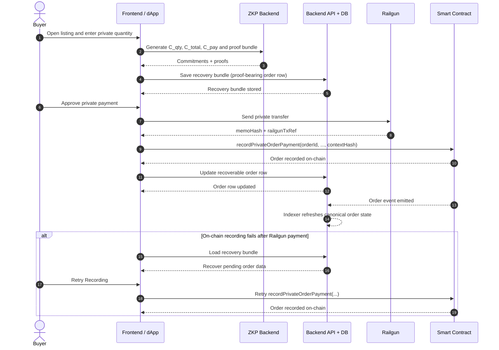

# Railgun Integration (Current) + How Privacy Works

This document describes how the repo currently uses Railgun in the V2 order flow.

## Buyer Payment Sequence Diagram

Notes:
- This diagram isolates the buyer payment path from the full marketplace lifecycle.
- Recovery is backend-based: the shared recovery bundle is the source of truth for retry, not browser-local order storage.
- The backend indexer refreshes canonical order state after on-chain events.

## A) How This Repo Integrates Railgun

## SDK / Engine Initialization
- Implemented in `frontend/src/lib/railgun-client-browser.js`
- Starts the local Railgun engine with POI support
- Loads Sepolia providers
- Injects the engine into the SDK singleton used by transfer and balance helpers

## Wallet Connection
- Implemented in `frontend/src/lib/railgun-clean/connection.js`
- User signs one fixed message (`RAILGUN_WALLET_SIGNATURE_MESSAGE`)
- The signature-derived key encrypts the mnemonic stored in local storage
- Reconnect restores the same Railgun wallet from that encrypted mnemonic

## Private Transfer Path
- Implemented in `frontend/src/lib/railgun-clean/operations/transfer.js`
- The SDK flow is:
  1. `gasEstimateForUnprovenTransfer`
  2. `generateTransferProof`
  3. `populateProvedTransfer`
- Transaction is sent with the connected EOA signer (`sendWithPublicWallet = true`)
- The app extracts:
  - `memoHash`
  - `railgunTxRef`

These are the payment-side anchors used by the order flow.

## Order Math Around the Transfer
Before or during payment, the frontend computes:
- `quantity`
- `totalWei = unitPriceWei * quantity`
- `C_qty`
- `C_total`
- `C_pay`
- `orderId`

The app also binds the order to a canonical context:

`contextHash = keccak256(abi.encode(orderId, memoHash, railgunTxRef, productId, chainId, escrowAddr, unitPriceHash))`

Implementation detail:
- `productId` and `chainId` are normalized as decimal strings in the app/backend
- the canonical backend encoding hashes them as `uint256` values
- order amounts are handled as exact integer strings and validated against the active scalar commitment path, not a legacy `u64`-only path

## On-Chain Linking in This App
After the private transfer succeeds, the app records the order with:

`recordPrivateOrderPayment(orderId, memoHash, railgunTxRef, quantityCommitment, totalCommitment, paymentCommitment, contextHash)`

Before that chain call, the app writes a backend recovery bundle so retry/recovery can resume from shared backend state instead of browser-local order state.

Later, the seller confirms the order with:

`confirmOrderById(orderId, cid)`

The escrow contract stores:
- `activeOrderId`
- the order commitments and anchor hashes
- `vcHash = keccak256(bytes(cid))`

## Privacy Boundary in the Current Implementation
Public:
- listing exists
- `unitPriceWei`
- `unitPriceHash`
- `memoHash`
- `railgunTxRef`
- commitment hashes
- `contextHash`
- VC CID hash anchor

Private:
- `quantity`
- `totalWei`
- openings / blindings for `C_qty`, `C_total`, `C_pay`

Verified privately:
- `totalWei = unitPriceWei * quantity`
- `C_total == C_pay`

This means Railgun provides the private transfer path, while the application adds order-specific commitment and proof binding around that transfer.

## Operational Recovery and Durability
- the backend stores one recoverable `product_orders` row keyed by `orderId`, including the proof payloads that are later embedded in the final VRC
- a backend reconciler can rebuild missing order rows from live chain state
- a backend indexer polls Sepolia events and refreshes tracked order state automatically
- final VCs are archived to backend storage and later fetched archive-first, then from multiple IPFS gateways if needed

## Current Limitation
The current system does not claim direct cryptographic binding to Railgun's internal hidden amount witness.
Instead, it binds the application-level payment commitment and Railgun transfer references through:
- `memoHash`
- `railgunTxRef`
- `orderId`
- `contextHash`

That is the shipped trust boundary today.

## B) How Railgun Privacy Works (Official High Level)
- Railgun uses shielded notes / commitments and Merkle trees for private state
- users prove spend validity with zero-knowledge proofs without revealing amounts
- nullifiers prevent double-spending while keeping note contents private
- the flow conceptually includes shield, private transact, and optional unshield
- Proof of Innocence (POI) supports compliance-oriented spend validity checks on supported flows

## Official References
- Docs home: https://docs.railgun.org/
- SDK overview: https://docs.railgun.org/developer-guide/wallet-sdk/overview
- Shield flow: https://docs.railgun.org/developer-guide/wallet-sdk/transactions/shield
- Transact flow: https://docs.railgun.org/developer-guide/wallet-sdk/transactions/transact
- Unshield flow: https://docs.railgun.org/developer-guide/wallet-sdk/transactions/unshield
- Proof of Innocence: https://docs.railgun.org/wiki/learn/proof-of-innocence-poi
