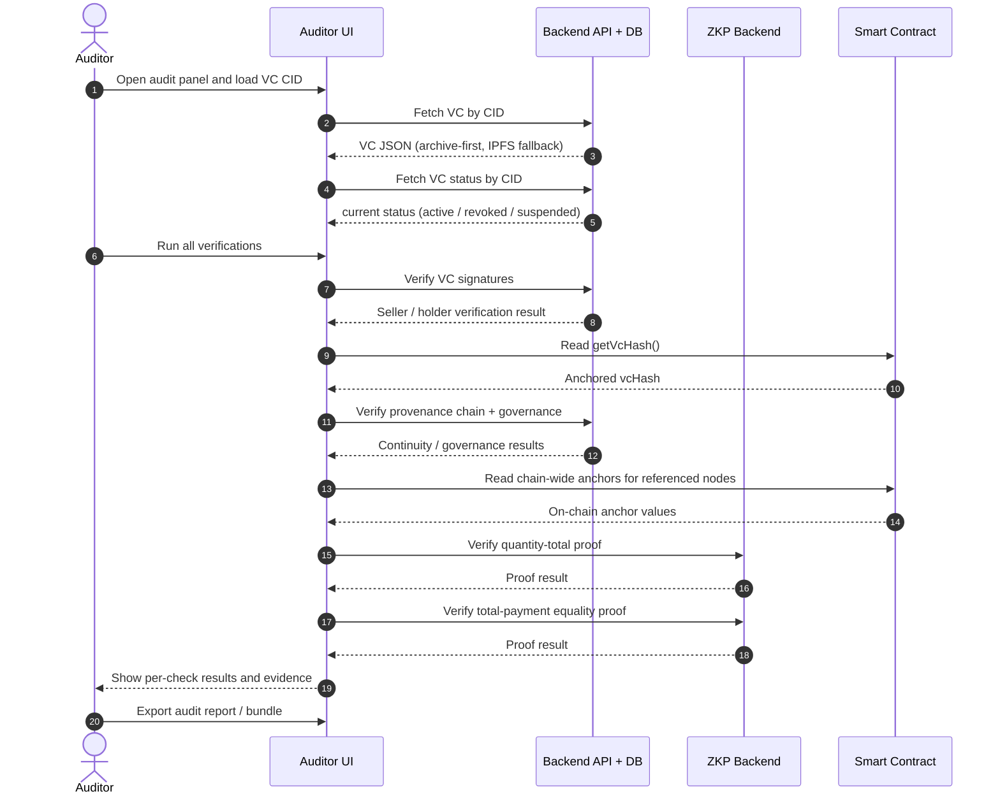

# Auditor Verification (Current Model)

This matches the current auditor UI, backend behavior, and V2 order math.

## Auditor Sequence Diagram

Notes:
- `Backend API + DB` is grouped as one lane to keep the diagram simple.
- The credential-status check is operational: a VC can be cryptographically valid and still fail if its status is `revoked` or `suspended`.
- The proof payloads are embedded in the final VRC itself; the auditor verifies one immutable signed artifact plus on-chain anchor and status checks.

## Active Verification Checks
In `VerifyVCInline.js`, `Run All` executes:
1. VC signatures
2. credential status (`active` / `revoked` / `suspended`) from backend status registry
3. current VC hash anchor (`hash(CID)` vs on-chain `getVcHash()`)
4. provenance continuity over the component graph
5. governance consistency over component links
6. chain-wide on-chain anchor checks for each provenance node
7. quantity-total proof validity
8. total-payment equality proof validity

The auditor UI now exposes:
- a readiness box
- one explanation/result box per verification check
- copyable evidence values
- `Export Audit Report`
- `Export VC + Report Bundle`
- `Export VC JSON`
- a structured VC viewer in addition to raw JSON

## Audit Inputs
Primary order fields read from the VC:
- `credentialSubject.listing.unitPriceWei`
- `credentialSubject.listing.unitPriceHash`
- `credentialSubject.order.orderId`
- `credentialSubject.order.memoHash`
- `credentialSubject.order.railgunTxRef`
- `credentialSubject.commitments.quantityCommitment`
- `credentialSubject.commitments.totalCommitment`
- `credentialSubject.commitments.paymentCommitment`
- `credentialSubject.attestation.contextHash`
- `credentialSubject.zkProofs`

Primary operational fetch/status sources:
- backend `vc_archives` for archive-first VC retrieval
- backend `vc_status` for current credential-status / revocation state

---

## 1) Signature Verification
- Backend file: `backend/api/verifyVC.js`
- Endpoint: `POST /verify-vc`
- Verifies EIP-712 typed-data proofs for issuer / seller
- Uses `did:ethr` registry-based DID resolution and `assertionMethod` authorization checks

Resolver config via backend env:
- `VC_DID_RESOLUTION_MODE=registry|legacy` (default `registry`)
- `VC_DID_RPC_URL` or `VC_DID_RPC_URL_<chainId>`
- optional `VC_ETHR_REGISTRY_ADDRESS` or `VC_ETHR_REGISTRY_<chainId>`
- optional `VC_DID_ALLOW_BARE_METHOD=true` for transitional legacy proofs

Holder proof remains optional.

## 1.1) What Is Actually Signed in the V2 VC
Signing path:
- `frontend/src/components/marketplace/ProductDetail.jsx`
- `frontend/src/utils/signVcWithMetamask.js`
- `frontend/src/utils/vcBuilder.mjs`

Current behavior:
1. Seller builds the final VC with `createFinalOrderVCV2(...)`.
2. `preparePayloadForSigning(...)` strips mutable sections from the typed-data payload:
   - `payment`
   - `delivery`
   - `previousVersion`
3. For the active V2 order VC, the signer uses the explicit typed payload format `eip712-v2-order-typed`.
4. Stable V2 listing/order/commitment/attestation/proof anchors are signed as nested typed structs:
   - `Listing`
   - `Order`
   - `Commitments`
   - `Attestation`
   - `ZkProofs`
   - `ProofData`
5. Seller signs the EIP-712 payload.

Practical effect:
- the active V2 path no longer hides anchors inside `credentialSubject.price`
- the signature directly covers the V2 order anchor payload, including:
  - listing unit price anchors
  - `orderId`
  - payment references
  - commitment hashes
  - `contextHash`
  - embedded proof payloads
- backend verification still supports the legacy payload format for older proofs, but the active order flow uses the typed V2 payload

## 1.2) Verification Path
Backend verification rebuilds the same canonical payload:
1. strips mutable post-signing fields
2. reconstructs either the legacy payload or the typed V2 payload based on `proof.payloadFormat`
3. resolves the expected `did:ethr` verification method
4. verifies the recovered signer matches the authorized DID method address

Detailed standards mapping remains in `docs/current/04-did-signing-and-verification-standards.md`.

---

## 2) Credential Status Verification
- Backend routes:
  - `GET /vc-status/:cid`
  - `PATCH /vc-status/:cid`
- status rows are keyed by CID in backend `vc_status`
- active values today:
  - `active`
  - `revoked`
  - `suspended`

Current behavior:
- a VC is auto-registered as `active` when archived or fetched
- auditor `Run All` reads the current status row by CID
- a revoked or suspended VC fails the status check even if its signature and anchors still verify

Operational control:
- status updates are token-gated with backend `VC_STATUS_ADMIN_TOKEN`
- this is the current revocation / operational validity layer for the system

## 3) Current VC Hash Anchor
- UI computes `keccak256(cid)`
- reads `getVcHash()` from the escrow contract
- passes only if the anchored on-chain hash matches the VC CID hash

## 4) Provenance Continuity
- Backend file: `backend/api/verifyVCChain.js`
- Endpoint: `POST /verify-vc-chain`
- Traverses the component VC graph through `componentCredentials`
- flags missing links, cycles, and truncation

## 5) Governance Consistency
For each provenance edge `parent -> component`:
- `parent.issuerAddress` must equal `component.holderAddress`

Violations are reported back to the auditor UI.

## 6) Chain-Wide Anchors
For each node in the provenance traversal:
- compute `keccak256(node.cid)`
- compare it with `getVcHash()` on the referenced product contract

The UI reports checked node count and failed nodes.

---

## 7) Quantity-Total Proof Verification
- Frontend utility: `frontend/src/utils/equalityProofClient.js`
- Backend endpoint: `POST /zkp/verify-quantity-total-proof`

Statement verified:
- `C_qty` and `C_total` are valid commitments
- they are related by `totalWei = unitPriceWei * quantity`
- the proof is bound to the same `contextHash`

Auditor inputs:
- `unitPriceWei`
- `quantityCommitment`
- `totalCommitment`
- `contextHash`
- embedded `zkProofs.quantityTotalProof`

Pass means:
- the private quantity and private total are internally consistent with the public unit price

Fail means:
- the proof, commitments, or bound context do not line up

## 8) Total-Payment Equality Proof Verification
- Frontend utility: `frontend/src/utils/equalityProofClient.js`
- Backend endpoint: `POST /zkp/verify-total-payment-equality-proof`

Statement verified:
- `C_total` and `C_pay` hide the same value
- the proof is bound to the same `contextHash`

Auditor inputs:
- `totalCommitment`
- `paymentCommitment`
- `contextHash`
- embedded `zkProofs.totalPaymentEqualityProof`

Pass means:
- the private order total matches the private payment amount

Fail means:
- the proof, commitments, or bound context do not line up

---

## Removed from the Current Auditor Model
These are intentionally not active auditor checks now:
- legacy ZKP price proof cards
- buyer `Verify Price` flow
- Workstream A / Workstream B UI terminology
- old `buyer_secrets.equality_proof` legacy path for the active order flow

## Backend Endpoints Summary
- `POST /fetch-vc`
- `POST /vc-archive`
- `GET /vc-status/:cid`
- `PATCH /vc-status/:cid`
- `POST /verify-vc`
- `POST /verify-vc-chain`
- `POST /zkp/verify-quantity-total-proof`
- `POST /zkp/verify-total-payment-equality-proof`

Frontend backend URL:
- `REACT_APP_VC_BACKEND_URL` (default `http://localhost:5000`)

ZKP backend URL:
- `REACT_APP_ZKP_BACKEND_URL` (default `http://localhost:5010`)
