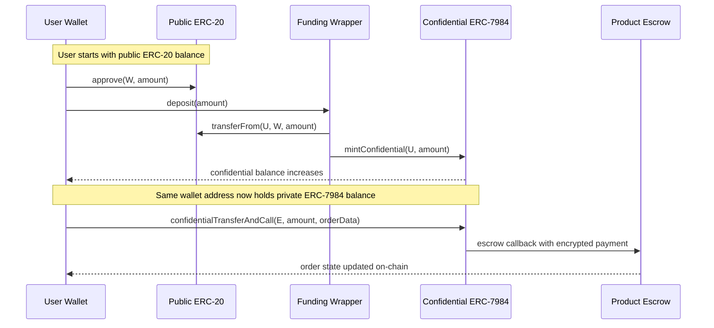
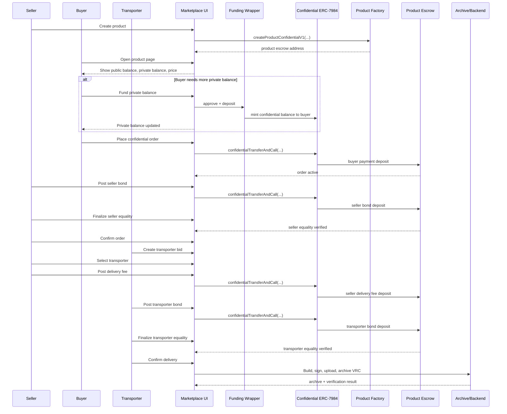

# Confidential Funding Wrapper Flow

This note explains the intended ERC-7984 funding model in the spike and the architecture we are moving toward.

## Goal

The user should be able to fund a private ERC-7984 settlement balance from a normal public asset without learning contract internals.

The conceptual UX is:

1. User holds a public asset.
2. User clicks `Fund private balance`.
3. The app deposits the public asset into a funding wrapper.
4. The wrapper mints equivalent confidential ERC-7984 balance to the same wallet.
5. The user spends that confidential balance inside the ERC-7984 escrow flow.

## Important distinction

- Native ETH is not an ERC-20.
- Sepolia ETH is the native gas token, not the settlement asset in this spike.
- In the current Sepolia evaluation path, the public funding asset is real WETH.
- A future production deployment could still swap this for another public ERC-20 such as a stablecoin.

So the intended evaluation and production-style flow is not:

- `ETH -> confidential ERC-7984`

It is more likely:

- `ETH -> WETH -> funding wrapper -> confidential ERC-7984`

or:

- `USDC -> funding wrapper -> confidential ERC-7984`

## Mental model

This is not an AMM pool.

It is closer to a custody-backed mint/redeem wrapper:

- the wrapper receives and holds a public ERC-20
- the wrapper issues matching confidential ERC-7984 balance
- later, an optional redeem path can burn confidential balance and release the public asset back

So the wrapper behaves like a vault-backed gateway, not a liquidity pool.

## High-level architecture

Components:

- User wallet
- Public ERC-20 funding token
- Funding wrapper contract
- Confidential ERC-7984 payment token
- ERC-7984 product escrow

Responsibilities:

- Public ERC-20:
  source asset used to fund private spending capacity
- Funding wrapper:
  locks the public asset and triggers confidential minting
- Confidential ERC-7984 token:
  stores encrypted balances per address
- Product escrow:
  consumes confidential ERC-7984 balances for buyer payment, seller bond, seller delivery fee, and transporter bond

## Sequence diagram

## Funding balance intuition

Before funding:

- user public ERC-20 balance: `100`
- wrapper public ERC-20 reserve: `0`
- user confidential ERC-7984 balance: `0`

After funding `100`:

- user public ERC-20 balance: `0`
- wrapper public ERC-20 reserve: `100`
- user confidential ERC-7984 balance: `100`

If a redeem path is added later:

1. user burns `100` confidential ERC-7984 units
2. wrapper releases `100` public ERC-20 back to the user

## Why this model fits ERC-7984

The ERC-7984 escrow flow needs private balances for:

- buyer purchase deposit
- seller bond
- seller delivery fee
- transporter bond

Using a funding wrapper means the user does not need:

- a separate privacy wallet
- a separate Railgun-style balance system
- manual admin minting in the normal flow

Instead, the same wallet address gains:

- public ERC-20 balance
- confidential ERC-7984 balance

The confidentiality lives in the ERC-7984 token ledger itself.

## Relationship to the browser flow

Current spike browser flow:

1. User gets public test ERC-20.
2. User funds private balance through the wrapper.
3. Buyer uses private balance for confidential purchase deposit.
4. Seller uses private balance for confidential bond and delivery fee.
5. Transporter uses private balance for confidential bond.

This replaces the earlier spike-only bootstrap model where an owner wallet directly minted confidential balances to test accounts.

## What is real today vs mocked

Real in the spike:

- real Sepolia deployment
- real browser wallet interaction
- real wrapper contract
- real confidential ERC-7984 token
- real confidential escrow flow

Still mocked or test-only:

- the public funding token is currently a mock ERC-20
- any previous mock-token faucet path is legacy/test-only
- the Sepolia evaluation path now uses real WETH as the public funding asset

## Desired end-state UX

The user should not see:

- wrapper address
- token contract addresses
- approve/deposit internals

The desired UI is:

1. `Fund private balance`
2. choose amount
3. click continue
4. app handles approval + deposit
5. private balance updates

## Desired marketplace flow UX

The funding step is only one part of the intended user journey.

The desired end-user flow is:

1. Seller creates a product.
2. Buyer opens the product page.
3. Buyer sees:
   - public balance
   - private balance
   - product price
4. If private balance is too low, buyer clicks `Fund private balance`.
5. App handles public approval + wrapper deposit automatically.
6. Buyer places the confidential order.
7. Seller posts confidential bond and confirms the order.
8. Transporter bids and is selected.
9. Seller posts confidential delivery fee.
10. Transporter posts confidential bond.
11. Delivery is confirmed.
12. App builds and archives the ERC-7984 VRC.

This means the normal user should think in terms of:

- fund private balance
- place order
- confirm order
- select transporter
- confirm delivery

The user should not think in terms of:

- wrapper address
- ERC-7984 token address
- encrypted transfer handles
- manual VC CID input
- raw order-id management

## Desired UX sequence diagram

## UX design goal

The final interface should feel like a normal marketplace with a private settlement rail underneath it.

The visible user concepts should be:

- product
- price
- private balance
- order
- transporter
- delivery
- credential/archive

The implementation concepts should stay hidden:

- wrapper
- commitment generation
- proof sidecar
- confidential token handles
- deposit-reference internals

## Recommended explanation in a meeting

Short framing:

> The desired UX is a standard marketplace flow where users only see a private balance and order actions. Under the hood, the app funds that private balance through a wrapper-backed ERC-20 to ERC-7984 conversion, and then uses the confidential ERC-7984 token to execute buyer payment, seller bond, transporter bond, and delivery settlement privately.

## Supervisor-level summary

One sentence:

> The funding model converts a normal public ERC-20 into a private ERC-7984 balance by locking the public token in a wrapper and minting matching confidential balance to the same wallet, which is then used directly in the confidential escrow flow.

Short version:

- not a pool
- not a swap
- not a second wallet
- it is a wrapper-backed private balance gateway
