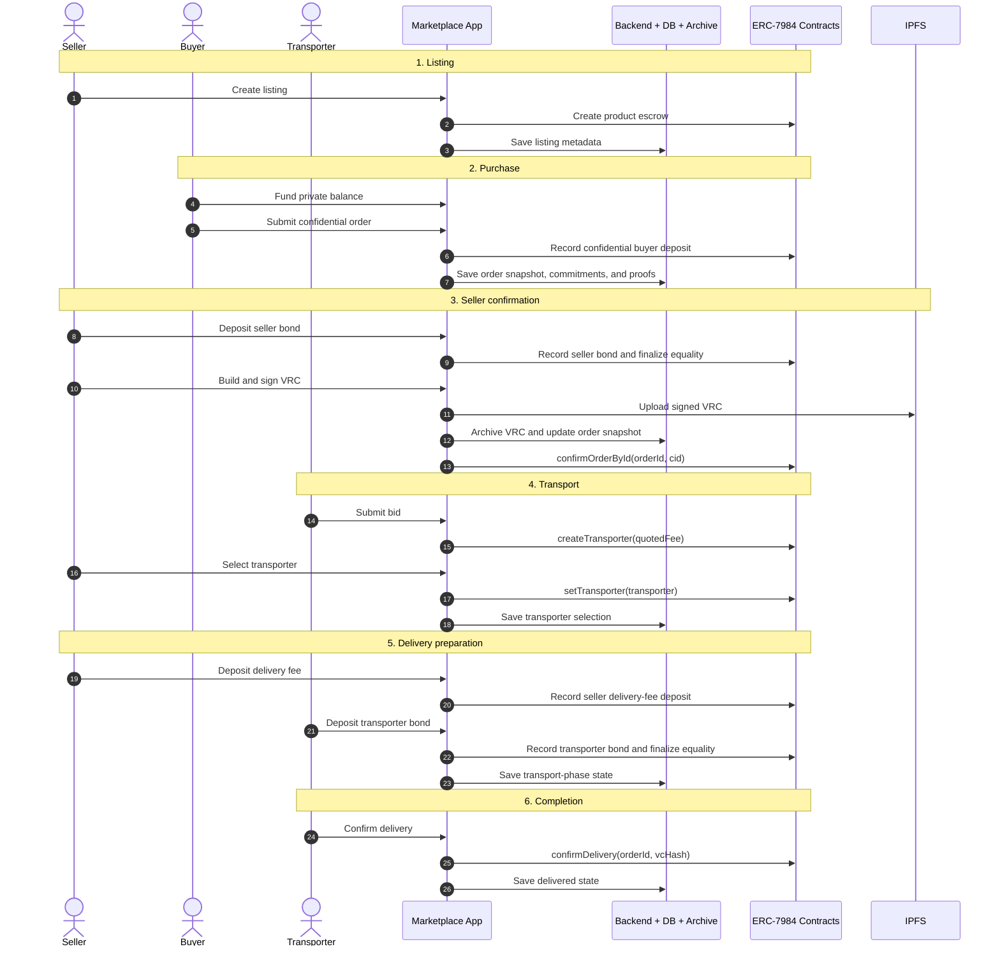

# ERC-7984 End-to-End Stakeholder Flow

This document describes the current main ERC-7984 marketplace flow end to end.

It is meant to answer four practical questions:

- who are the stakeholders
- what each stakeholder clicks or signs
- which frontend helpers and backend routes are triggered
- which smart-contract functions actually move the protocol forward

This is the current main-path flow, not the older Railgun/V2 flow.

## Scope

- network: Sepolia
- settlement model: ERC-7984 confidential token escrow
- actors: seller, buyer, transporter
- systems: frontend, wallet, fhevm/relayer support, backend API, SQLite DB, IPFS, smart contracts

## Stakeholders and system lanes

| Lane | Role in the flow |
| --- | --- |
| Seller | creates listing, posts seller bond, confirms order, selects transporter, posts delivery fee |
| Buyer | funds private balance, places confidential order deposit |
| Transporter | submits bid, posts transporter bond, confirms delivery |
| Frontend / dApp | orchestrates user actions, builds proofs/VRC data, calls backend routes and contracts |
| Wallet / MetaMask | signs transactions and VRC signatures |
| fhevm / relayer support | encrypts deposit values and decrypts public equality handles for finalization |
| Backend API | persists metadata/order snapshots, archives VRCs, serves verification and fetch routes |
| SQLite DB | stores metadata, order snapshots, VRC archive rows, and VC status |
| IPFS | stores the signed VRC artifact |
| Smart contracts | enforce confidential settlement, equality gating, transporter selection, and delivery settlement |

## Main contracts and entrypoints

| Contract | Main functions used in the flow |
| --- | --- |
| `ProductFactoryConfidential.sol` | `createProductConfidentialV1(...)` |
| `ConfidentialPaymentFundingWrapper.sol` | `deposit(uint256 amount)` |
| public funding ERC-20 | `approve(spender, amount)` |
| ERC-7984 confidential token | `confidentialTransferAndCall(address to, bytes32 handle, bytes inputProof, bytes data)` |
| `ProductEscrowConfidential_Initializer.sol` | `onConfidentialTransferReceived(...)`, `finalizeEqualityAttestation(...)`, `createTransporter(...)`, `setTransporter(...)`, `confirmOrderById(...)`, `confirmDelivery(...)` |

## Backend routes and primary tables

| Backend route | Used for | Primary table(s) |
| --- | --- | --- |
| `POST /metadata` | save listing metadata after product creation | `product_metadata` |
| `GET /metadata/:address` | load product/listing metadata | `product_metadata` |
| `POST /erc7984/orders/snapshot` | save and update the main ERC-7984 order snapshot | `product_orders` |
| `GET /orders/:orderId` | load the current saved order snapshot | `product_orders` |
| `POST /vc-archive` | archive signed VRC JSON after IPFS upload | `vc_archives`, `vc_status` |
| `POST /fetch-vc` | fetch VC archive-first, IPFS fallback | `vc_archives` |
| `GET /vc-status/:cid` | read credential status | `vc_status` |
| `POST /verify-vc` | verify seller signature / canonical VC payload | derived from archived VC |
| `POST /verify-vc-chain` | verify provenance chain continuity | archived VC plus fetch path |

Important current note:

- in the current main ERC-7984 path, `product_orders` is the key recovery and audit-support row
- `vc_archives` and `vc_status` hold the published VRC and its operational status

## Frontend components and helpers

| Area | Main files |
| --- | --- |
| seller listing creation | `frontend/src/components/marketplace/ProductFormStep3.jsx` |
| buyer deposit flow | `frontend/src/components/marketplace/Erc7984BuyerPurchaseCard.jsx` |
| seller order actions | `frontend/src/components/marketplace/Erc7984SellerOrderDetail.jsx` |
| transporter bid from product page | `frontend/src/components/marketplace/Erc7984TransporterBidCard.jsx` |
| transporter job actions | `frontend/src/components/marketplace/Erc7984TransporterJobDetail.jsx` |
| shared funding widget | `frontend/src/components/marketplace/Erc7984FundingCard.jsx` |
| order snapshot save | `frontend/src/utils/erc7984/orderSnapshotApi.js` |
| payment-bridge/proof bundle generation | `frontend/src/utils/erc7984/paymentBridgeSidecar.js` |
| VRC build/sign/upload/archive | `frontend/src/utils/erc7984/vrcFlow.js` |
| VC archive client | `frontend/src/utils/verifyVc.js` |

## High-level sequence diagram

The goal of this diagram is orientation, not exhaustiveness.

- the diagram below shows the major phase transitions and system handoffs
- the exact handler names, backend routes, and contract functions are listed in the trigger tables that follow
- if a diagram tries to show every helper call, it stops being a visualization and turns into a log dump
- the diagram intentionally collapses several technical subsystems into broader lanes
  - funding wrapper, token contract, signer, and relayer support are treated as implementation detail here
  - those details still exist, but they are better kept in the tables below than in the main visual

## Architectural note on centralization

Your concern is valid.

The current operational flow relies heavily on:

- backend order snapshots
- backend VRC archive rows
- backend VC status rows

That makes the marketplace easier to operate and recover, but it also introduces a centralizing tendency in the current spike architecture.

The intended longer-term direction should be:

- smart contracts as the source of truth for settlement state
- IPFS VRCs as the source of truth for the signed artifact
- backend as an indexing, caching, and convenience layer

So the current backend-heavy flow is acceptable for the spike, but it is also a real future-work item:

- reduce backend dependence where possible
- keep recovery and indexing benefits without making the backend the trust root
- separate "operational convenience" from "audit trust"

## Trigger map by phase

### 1. Seller creates listing

| Triggered by | Frontend trigger | Backend trigger | Contract trigger | Result |
| --- | --- | --- | --- | --- |
| Seller | `ProductFormStep3.handleConfirm()` | `saveProductMeta()` -> `POST /metadata` | `createProductConfidentialV1(...)` | product escrow is deployed and metadata is stored |

### 2. Any actor funds private balance

| Triggered by | Frontend trigger | Backend trigger | Contract trigger | Result |
| --- | --- | --- | --- | --- |
| Buyer, seller, or transporter | `Erc7984FundingCard` / funding section in action workbench | none required | public token `approve(...)`, then wrapper `deposit(amount)` | public ERC-20 becomes confidential ERC-7984 balance |

### 3. Buyer places confidential order

| Triggered by | Frontend trigger | Backend trigger | Contract trigger | Result |
| --- | --- | --- | --- | --- |
| Buyer | `Erc7984BuyerPurchaseCard.handleConfidentialPurchase()` | `saveErc7984OrderSnapshot()` -> `POST /erc7984/orders/snapshot` | token `confidentialTransferAndCall(...)` -> escrow `onConfidentialTransferReceived(...)` | order enters `Purchased`, commitments/proofs are persisted |

Important frontend helpers in this step:

- `generateOrderId()`
- `encryptUint64ForContract(...)`
- `buildDepositReference(...)`
- `generateBuyerPaymentBridgeSidecar(...)`

### 4. Seller deposits seller bond and finalizes seller equality

| Triggered by | Frontend trigger | Backend trigger | Contract trigger | Result |
| --- | --- | --- | --- | --- |
| Seller | `Erc7984SellerOrderDetail.handlePrepareSellerBond()` and seller equality finalization helper | `saveErc7984OrderSnapshot()` | token `confidentialTransferAndCall(...)`, then escrow `finalizeEqualityAttestation(...)` | seller bond is recorded and equality state becomes verified |

### 5. Seller builds, signs, uploads, archives, and binds the VRC

| Triggered by | Frontend trigger | Backend trigger | Contract trigger | Result |
| --- | --- | --- | --- | --- |
| Seller | `buildErc7984OrderVrcFromRecovery(...)`, `signUploadArchiveErc7984OrderVrc(...)`, `Erc7984SellerOrderDetail.handleConfirmOrder()` | `GET /orders/:orderId`, `POST /vc-archive`, optional snapshot refresh | `confirmOrderById(orderId, cid)` | signed VRC is uploaded, archived, and anchored on-chain |

Important frontend helpers in this step:

- `buildErc7984OrderVrcFromRecovery(...)`
- `signUploadArchiveErc7984OrderVrc(...)`
- `archiveVCWithServer(...)`

### 6. Transporter bids

| Triggered by | Frontend trigger | Backend trigger | Contract trigger | Result |
| --- | --- | --- | --- | --- |
| Transporter | `Erc7984TransporterBidCard.handleCreateBid()` or `Erc7984TransporterJobDetail.handleCreateBid()` | none required | `createTransporter(quotedFee)` | transporter bid is registered on-chain |

### 7. Seller selects transporter

| Triggered by | Frontend trigger | Backend trigger | Contract trigger | Result |
| --- | --- | --- | --- | --- |
| Seller | `Erc7984SellerOrderDetail.handleSelectTransporter()` | `saveErc7984OrderSnapshot()` | `setTransporter(address)` | selected transporter is bound and phase moves to `Bound` |

### 8. Seller deposits delivery fee

| Triggered by | Frontend trigger | Backend trigger | Contract trigger | Result |
| --- | --- | --- | --- | --- |
| Seller | `Erc7984SellerOrderDetail.handleDepositSellerDeliveryFee()` | `saveErc7984OrderSnapshot()` | token `confidentialTransferAndCall(...)` -> escrow callback | delivery-fee deposit is recorded |

### 9. Transporter deposits transporter bond and finalizes transporter equality

| Triggered by | Frontend trigger | Backend trigger | Contract trigger | Result |
| --- | --- | --- | --- | --- |
| Transporter | `Erc7984TransporterJobDetail.handlePrepareTransporterBond()` | `saveErc7984OrderSnapshot()` | token `confidentialTransferAndCall(...)`, then `finalizeEqualityAttestation(...)` | transporter bond is recorded and transporter equality becomes verified |

### 10. Transporter confirms delivery

| Triggered by | Frontend trigger | Backend trigger | Contract trigger | Result |
| --- | --- | --- | --- | --- |
| Transporter | `Erc7984TransporterJobDetail.handleConfirmDelivery()` | `saveErc7984OrderSnapshot()` | `confirmDelivery(orderId, vcHash)` | phase moves to `Delivered` and settlement is released |

## Stakeholder-by-stakeholder checklist

### Seller

Seller directly triggers:

- `createProductConfidentialV1(...)`
- seller-bond `confidentialTransferAndCall(...)`
- `finalizeEqualityAttestation(...)` for seller bond
- VRC build/sign/upload/archive flow
- `confirmOrderById(...)`
- `setTransporter(...)`
- seller delivery-fee `confidentialTransferAndCall(...)`

### Buyer

Buyer directly triggers:

- public token `approve(...)`
- funding wrapper `deposit(...)`
- buyer purchase `confidentialTransferAndCall(...)`
- proof bundle generation through `generateBuyerPaymentBridgeSidecar(...)`
- order snapshot persistence through `POST /erc7984/orders/snapshot`

### Transporter

Transporter directly triggers:

- `createTransporter(...)`
- transporter-bond `confidentialTransferAndCall(...)`
- `finalizeEqualityAttestation(...)` for transporter bond
- `confirmDelivery(...)`

## What the DB stores at each stage

| Table | When it is written | Why it exists |
| --- | --- | --- |
| `product_metadata` | after listing creation | stores listing/product metadata and public price fields |
| `product_orders` | after buyer deposit and after each major state update | stores the current recovery row for order status, commitments, proofs, attestation snapshots, VRC hash/CID, and delivery state |
| `vc_archives` | after seller uploads and archives the signed VRC | stores canonical VRC JSON by CID |
| `vc_status` | alongside VC archive and later status operations | stores active/revoked/suspended operational status |
| `indexed_products`, `indexer_state` | internal backend indexing support | support chain refresh/indexing |

## Practical reading of the flow

If you want the shortest mental model, it is this:

1. seller creates product and backend stores public metadata
2. each actor can fund private balance through wrapper `deposit(...)`
3. buyer makes confidential purchase deposit and frontend saves the proof-complete order snapshot
4. seller deposits bond, finalizes equality, signs/uploads/archives VRC, and binds CID with `confirmOrderById(...)`
5. transporter bids, seller selects transporter, seller deposits delivery fee
6. transporter deposits bond, finalizes equality, and confirms delivery with the bound `vcHash`

## Related docs

- `docs/erc7984-spike/06-confidential-funding-wrapper-flow.md`
- `docs/erc7984-spike/07-typed-payment-bridge-architecture-note.md`
- `docs/erc7984-spike/05-payment-bridge-artifact-spec.md`
- `docs/erc7984-spike/11-smart-contract-function-map-and-transaction-note.md`
