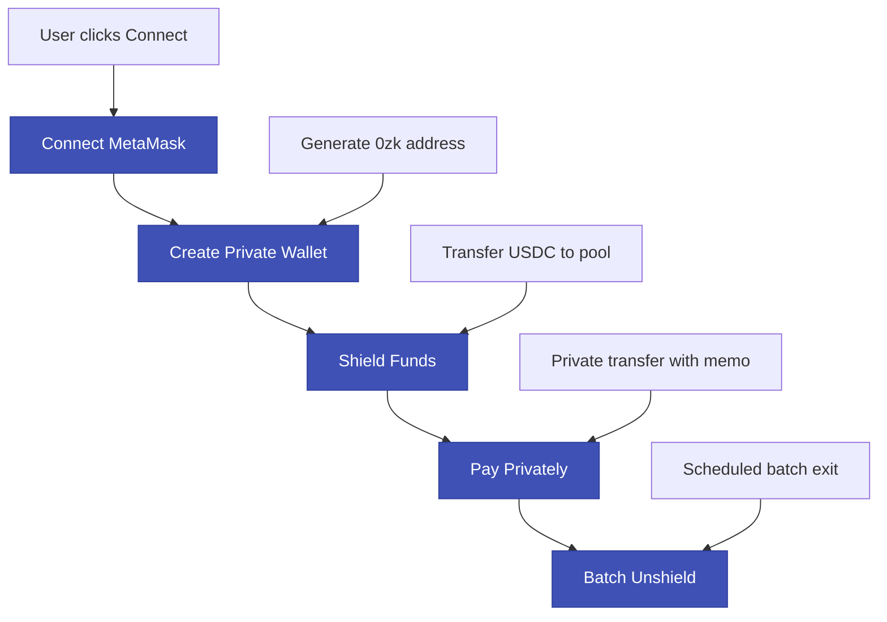

# Railgun Audit & Operations Guide - Encrypted Memo + On-Chain Anchor

## 18.1 Chosen Audit Mode: Encrypted Memo + On-Chain Anchor

**Selected Approach:** For each private payment, include an encrypted memo `m = keccak(productId || vc_hash || nonce [|| amount?])`. Store `m` (or `keccak(m)`) in your escrow via `recordPrivatePayment`. Later, reveal plaintext memo to auditor → recompute hash → match to the Railgun tx.

### Why This Approach for EV Battery Marketplace

#### **Perfect Fit for Current Architecture**
- ✅ **Already implemented**: You have `priceCommitment` and VC anchoring
- ✅ **Minimal changes**: Just add memo creation and verification
- ✅ **Familiar pattern**: Similar to your existing commitment/reveal system

#### **Ideal for Battery Supply Chain Audits**
- ✅ **Product-specific**: Each memo binds to a specific `productId` and `vc_hash`
- ✅ **Regulatory compliance**: EU battery passport requirements
- ✅ **Selective disclosure**: Reveal only what's needed for specific audits

#### **Operational Simplicity**
- ✅ **No key management complexity**: No need for view-only keys
- ✅ **Standard workflow**: Similar to your current `revealAndConfirmDelivery`
- ✅ **Easy integration**: Works with your existing frontend

### Implementation Status ✅

**Smart Contract Integration:**
- ✅ `ProductEscrow.sol` updated with Railgun integration
- ✅ `recordPrivatePayment()` function implemented and tested
- ✅ `hasPrivatePayment()` and `getPrivatePaymentDetails()` view functions
- ✅ Custom errors for proper error handling
- ✅ Event emission for audit tracking
- ✅ Comprehensive test coverage (basic + comprehensive test suites)

**Memo Creation:**
```javascript
// Create memo for payment
const createMemo = (productId, vcHash, amount, nonce) => {
    return keccak256(abi.encodePacked(productId, vcHash, amount, nonce));
};

// Alternative: Include amount for full audit capability
const createMemoWithAmount = (productId, vcHash, amount, nonce) => {
    return keccak256(abi.encodePacked(productId, vcHash, amount, nonce));
};

// Alternative: Amount-blind memo (privacy-focused)
const createBlindMemo = (productId, vcHash, nonce) => {
    return keccak256(abi.encodePacked(productId, vcHash, nonce));
};
```

**Memo Verification:**
```javascript
// Verify memo during audit
const verifyMemo = (productId, vcHash, amount, nonce, memoHash) => {
    const computed = createMemo(productId, vcHash, amount, nonce);
    return computed === memoHash;
};

// Verify blind memo (amount not included)
const verifyBlindMemo = (productId, vcHash, nonce, memoHash) => {
    const computed = createBlindMemo(productId, vcHash, nonce);
    return computed === memoHash;
};
```

---

## 18.2 Wallet Model & User Flow

### Wallet Architecture
The Railgun integration uses a **dual-wallet model**:
- **MetaMask Wallet**: Public Ethereum wallet for L1 operations (shields/unshields)
- **Railgun Wallet**: Private 0zk wallet for confidential transactions within the pool

### User Journey Flow



### UI Flow Implementation

**Step 1: Connect MetaMask**
```javascript
const connectMetaMask = async () => {
    if (window.ethereum) {
        const provider = new ethers.BrowserProvider(window.ethereum);
        const signer = await provider.getSigner();
        const address = await signer.getAddress();
        
        setMetaMaskWallet({
            provider,
            signer,
            address
        });
        
        return address;
    }
};
```

**Step 2: Create Private Wallet**
```javascript
const createPrivateWallet = async (metaMaskWallet) => {
    // Derive private wallet from MetaMask
    const railgunWallet = await RailgunWallet.createFromEthersWallet(
        metaMaskWallet.signer
    );
    
    setRailgunWallet(railgunWallet);
    
    return railgunWallet.getAddress();
};
```

**Step 3: Shield Funds**
```javascript
const shieldFunds = async (amount) => {
    const shieldTx = await railgunWallet.shield({
        tokenAddress: USDC_ADDRESS,
        amount: amount,
        recipient: railgunWallet.getAddress()
    });
    
    return shieldTx;
};
```

**Step 4: Pay Privately**
```javascript
const payPrivately = async (product, vcHash) => {
    const nonce = Date.now();
    const memo = createMemo(product.id, vcHash, product.price, nonce);
    
    const privateTransfer = await railgunWallet.createPrivateTransfer({
        outputs: [
            { recipient: sellerWallet.getAddress(), amount: product.price },
            { recipient: transporterWallet.getAddress(), amount: product.deliveryFee }
        ],
        memo: memo,
        tokenAddress: USDC_ADDRESS
    });
    
    const relayerTx = await submitViaRelayer(privateTransfer);
    
    // Record payment on escrow contract
    await escrowContract.recordPrivatePayment(product.id, memo, relayerTx.hash);
    
    return { memo, txHash: relayerTx.hash };
};
```

**Step 5: Batch Unshield**
```javascript
const scheduleBatchUnshield = async (amount) => {
    // Schedule for next batch window (e.g., every 12 hours)
    const unshieldTx = await railgunWallet.unshield({
        tokenAddress: USDC_ADDRESS,
        amount: amount,
        recipient: metaMaskWallet.address
    });
    
    return unshieldTx;
};
```

### React Component Flow
```javascript
const RailgunPaymentFlow = ({ product, onComplete }) => {
    const [step, setStep] = useState('connect');
    const [metaMaskWallet, setMetaMaskWallet] = useState(null);
    const [railgunWallet, setRailgunWallet] = useState(null);
    const [txHash, setTxHash] = useState(null);
    
    const handleConnect = async () => {
        const address = await connectMetaMask();
        setMetaMaskWallet({ address });
        setStep('create-wallet');
    };
    
    const handleCreateWallet = async () => {
        const privateAddress = await createPrivateWallet(metaMaskWallet);
        setRailgunWallet({ address: privateAddress });
        setStep('shield');
    };
    
    const handleShield = async () => {
        await shieldFunds(product.price + product.deliveryFee);
        setStep('pay');
    };
    
    const handlePay = async () => {
        const result = await payPrivately(product, product.vcHash);
        setTxHash(result.txHash);
        setStep('complete');
        onComplete(result);
    };
    
    return (
        <div className="railgun-flow">
            {step === 'connect' && (
                <ConnectStep onConnect={handleConnect} />
            )}
            {step === 'create-wallet' && (
                <CreateWalletStep onCreate={handleCreateWallet} />
            )}
            {step === 'shield' && (
                <ShieldStep onShield={handleShield} />
            )}
            {step === 'pay' && (
                <PayStep onPay={handlePay} />
            )}
            {step === 'complete' && (
                <CompleteStep txHash={txHash} />
            )}
        </div>
    );
};
```

### Privacy Benefits
- **MetaMask**: Only used for L1 operations (visible on blockchain)
- **Railgun Wallet**: Handles all private transactions (hidden from public view)
- **Batch Unshield**: Reduces correlation between delivery and withdrawal
- **Memo Binding**: Links payments to products without revealing amounts

---

## 18.3 Standard Operating Procedure (SOP) for Memo-Based Audits

### 1. Scope Definition
Auditor requests: productId(s), date window, stakeholder(s), audit type.

**Audit Request Form:**
```javascript
const auditRequest = {
    productIds: ['12345', '12346'],
    dateWindow: {
        start: '2024-01-01T00:00:00Z',
        end: '2024-01-31T23:59:59Z'
    },
    stakeholders: ['seller', 'transporter'],
    auditType: 'memo-verification',
    scope: 'full-reconciliation', // or 'sample-verification'
    amountDisclosure: 'required' // or 'optional', 'forbidden'
};
```

### 2. Anchor Lookup
Query escrow storage/events for `PaidPrivately(productId, memoHash, txRef)`.

**Implementation:**
```javascript
const lookupPaymentRecords = async (productIds, dateWindow) => {
    const events = await escrowContract.queryFilter(
        escrowContract.filters.PaidPrivately(),
        dateWindow.start,
        dateWindow.end
    );
    
    return events.filter(event => 
        productIds.includes(event.args.productId.toString())
    );
};

// Get detailed payment records
const getPaymentRecord = async (productId) => {
    const [memoHash, railgunTxRef, recorder] = await escrowContract.getPrivatePaymentDetails();
    const hasPayment = await escrowContract.hasPrivatePayment();
    
    return {
        productId: productId,
        memoHash: memoHash,
        railgunTxRef: railgunTxRef,
        recorder: recorder,
        hasPayment: hasPayment
    };
};
```

### 3. Memo Verification Process

#### Memo Verification Path
```javascript
const auditWithMemo = async (productId, vcHash, amount, nonce, memoHash) => {
    const computedMemo = createMemo(productId, vcHash, amount, nonce);
    const isValid = computedMemo === memoHash;
    
    return {
        verified: isValid,
        computedMemo: computedMemo,
        providedMemo: memoHash,
        amount: amount,
        productId: productId,
        vcHash: vcHash,
        nonce: nonce
    };
};

// For amount-blind memos
const auditWithBlindMemo = async (productId, vcHash, nonce, memoHash) => {
    const computedMemo = createBlindMemo(productId, vcHash, nonce);
    const isValid = computedMemo === memoHash;
    
    return {
        verified: isValid,
        computedMemo: computedMemo,
        providedMemo: memoHash,
        productId: productId,
        vcHash: vcHash,
        nonce: nonce,
        amountDisclosed: false
    };
};
```

### 4. Reconciliation
Match with off-chain invoice/VC record identified by `vc_hash`.

**Implementation:**
```javascript
const reconcilePayment = async (paymentRecord, vcRecord) => {
    const reconciliation = {
        productId: paymentRecord.productId,
        vcHash: paymentRecord.vcHash,
        railgunTxRef: paymentRecord.railgunTxRef,
        memoHash: paymentRecord.memoHash,
        amount: paymentRecord.amount,
        timestamp: paymentRecord.timestamp,
        vcVerified: paymentRecord.vcHash === vcRecord.hash,
        amountVerified: paymentRecord.amount === vcRecord.amount,
        memoVerified: paymentRecord.memoVerified,
        status: 'reconciled' // or 'discrepancy', 'pending'
    };
    
    return reconciliation;
};
```

### 5. Report Generation
Export CSV of `{productId, vc_hash, txRef, memoHash, amount?(if disclosed), timestamp}`.

**Receipt JSON Schema:**
```json
{
  "productId": "12345",
  "vc_hash": "0x...",
  "railgun_tx_ref": "0x...",
  "memo_hash": "0x...",
  "stakeholder": "seller",
  "amount_disclosed": "optional",
  "timestamp": "ISO8601",
  "audit_type": "memo-verification",
  "reconciliation_status": "verified",
  "memo_verification": "passed",
  "auditor_signature": "0x..."
}
```

---

## 18.4 Smart Contract Integration ✅

### Enhanced ProductEscrow Contract

**New Events & Storage:**
```solidity
// Enhanced events for memo-based audit tracking
event PrivatePaymentRecorded(uint256 indexed productId, bytes32 memoHash, bytes32 railgunTxRef, address indexed recorder);
event PaidPrivately(uint256 indexed productId, bytes32 memoHash, bytes32 railgunTxRef);

// Enhanced storage for audit linking
mapping(bytes32 => bool) public privatePayments; // Track recorded private payments by memoHash
mapping(uint256 => bytes32) public productMemoHashes; // Link productId to memoHash
mapping(uint256 => bytes32) public productRailgunTxRefs; // Link productId to Railgun tx reference
mapping(bytes32 => bool) public usedMemoHash; // Global reuse guard for memos
mapping(uint256 => address) public productPaidBy; // Track who recorded the payment (for audit)
```

**Enhanced Functions:**
```solidity
function recordPrivatePayment(uint256 _productId, bytes32 _memoHash, bytes32 _railgunTxRef) external {
    // Input validation
    if (_productId != id) revert NotRegistered(); // Ensure correct product
    if (_memoHash == bytes32(0)) revert ZeroMemoHash();
    if (_railgunTxRef == bytes32(0)) revert ZeroTxRef();
    
    // Phase and state validation
    if (phase != Phase.Bound) revert WrongPhase(Phase.Bound, phase);
    if (delivered) revert Delivered();
    if (transporter == address(0)) revert NotTransporter();
    
    // Prevent multiple payments for the same product
    if (productMemoHashes[id] != bytes32(0)) revert AlreadyPaid();
    
    // Prevent global memo reuse first (cross-product protection)
    if (usedMemoHash[_memoHash]) revert Exists();
    
    // Prevent duplicate recordings for this specific memo
    if (privatePayments[_memoHash]) revert Exists();
    
    // Only allow buyer, seller, or transporter to record
    if (msg.sender != buyer && msg.sender != owner && msg.sender != transporter) revert NotParticipant();
    
    // Record the private payment
    privatePayments[_memoHash] = true;
    usedMemoHash[_memoHash] = true;
    productMemoHashes[id] = _memoHash;
    productRailgunTxRefs[id] = _railgunTxRef;
    productPaidBy[id] = msg.sender; // Track who recorded for audit
    
    emit PrivatePaymentRecorded(id, _memoHash, _railgunTxRef, msg.sender);
}

function hasPrivatePayment() external view returns (bool) {
    return productMemoHashes[id] != bytes32(0);
}

function getPrivatePaymentDetails() external view returns (bytes32 memoHash, bytes32 railgunTxRef, address recorder) {
    memoHash = productMemoHashes[id];
    railgunTxRef = productRailgunTxRefs[id];
    recorder = productPaidBy[id];
}
```

---

## 18.5 Client Integration for Memo-Based Audits

### Payment Flow with Memo Creation
```javascript
// Enhanced payment flow with memo creation
const executePrivatePayment = async (product, vcHash) => {
    // 1. Create memo
    const nonce = Date.now(); // or use a more secure nonce
    const memo = createMemo(product.id, vcHash, product.price, nonce);
    
    // 2. Execute private transfer with memo
    const privateTransfer = await buyerWallet.createPrivateTransfer({
        outputs: [
            { recipient: sellerWallet.getAddress(), amount: product.price },
            { recipient: transporterWallet.getAddress(), amount: product.deliveryFee }
        ],
        memo: memo,
        tokenAddress: USDC_ADDRESS
    });
    
    // 3. Submit via relayer
    const relayerTx = await submitViaRelayer(privateTransfer);
    
    // 4. Record payment on escrow
    await escrowContract.recordPrivatePayment(product.id, memo, relayerTx.hash);
    
    // 5. Store memo details for audit
    await storeMemoDetails(product.id, vcHash, product.price, nonce, memo);
    
    return { memo, txHash: relayerTx.hash, nonce };
};
```

### Memo Storage for Audits
```javascript
// Store memo details for later audit verification
const storeMemoDetails = async (productId, vcHash, amount, nonce, memoHash) => {
    const memoDetails = {
        productId: productId,
        vcHash: vcHash,
        amount: amount,
        nonce: nonce,
        memoHash: memoHash,
        timestamp: Date.now(),
        stakeholder: 'buyer' // or seller/transporter
    };
    
    // Store in local database or encrypted storage
    await localStorage.setItem(`memo_${productId}`, JSON.stringify(memoDetails));
    
    // Optionally store in IPFS for decentralized audit trail
    const ipfsHash = await uploadToIPFS(memoDetails);
    console.log(`Memo details stored in IPFS: ${ipfsHash}`);
};
```

### Audit Verification Interface
```javascript
// React component for audit verification
const AuditVerification = ({ productId }) => {
    const [memoDetails, setMemoDetails] = useState(null);
    const [verificationResult, setVerificationResult] = useState(null);
    
    const verifyMemo = async () => {
        const details = JSON.parse(localStorage.getItem(`memo_${productId}`));
        setMemoDetails(details);
        
        const result = await escrowContract.verifyMemo(
            productId,
            details.vcHash,
            details.amount,
            details.nonce
        );
        
        setVerificationResult(result);
    };
    
    return (
        <div>
            <h3>Audit Verification for Product {productId}</h3>
            {memoDetails && (
                <div>
                    <p>VC Hash: {memoDetails.vcHash}</p>
                    <p>Amount: {memoDetails.amount}</p>
                    <p>Nonce: {memoDetails.nonce}</p>
                    <p>Memo Hash: {memoDetails.memoHash}</p>
                </div>
            )}
            {verificationResult !== null && (
                <div>
                    <p>Verification Result: {verificationResult ? 'PASSED' : 'FAILED'}</p>
                </div>
            )}
            <button onClick={verifyMemo}>Verify Memo</button>
        </div>
    );
};
```

---

## 18.6 Audit Tools & Infrastructure

### Audit Dashboard
```javascript
// Audit dashboard for memo-based verification
const auditDashboard = {
    features: [
        'payment record lookup by productId',
        'memo verification tools',
        'reconciliation status tracking',
        'audit report generation',
        'memo history tracking'
    ],
    exports: [
        'CSV reports with memo verification status',
        'JSON receipts with memo details',
        'PDF audit reports',
        'blockchain proof verification'
    ]
};
```

### Automated Audit Verification
```javascript
// Automated audit verification service
class MemoAuditService {
    constructor(escrowContract) {
        this.escrowContract = escrowContract;
    }
    
    async verifyPaymentBatch(productIds) {
        const results = [];
        
        for (const productId of productIds) {
            try {
                const [memoHash, railgunTxRef, recorder] = await this.escrowContract.getPrivatePaymentDetails();
                const hasPayment = await this.escrowContract.hasPrivatePayment();
                const memoDetails = this.getMemoDetails(productId);
                
                if (memoDetails && hasPayment) {
                    const verified = await this.verifyMemo(
                        productId,
                        memoDetails.vcHash,
                        memoDetails.amount,
                        memoDetails.nonce,
                        memoHash
                    );
                    
                    results.push({
                        productId,
                        verified,
                        memoHash: memoHash,
                        railgunTxRef: railgunTxRef,
                        recorder: recorder,
                        timestamp: Date.now()
                    });
                }
            } catch (error) {
                console.error(`Failed to verify product ${productId}:`, error);
                results.push({
                    productId,
                    verified: false,
                    error: error.message
                });
            }
        }
        
        return results;
    }
    
    async generateAuditReport(productIds, dateRange) {
        const verificationResults = await this.verifyPaymentBatch(productIds);
        
        const report = {
            dateRange: dateRange,
            totalProducts: productIds.length,
            verifiedPayments: verificationResults.filter(r => r.verified).length,
            failedVerifications: verificationResults.filter(r => !r.verified).length,
            results: verificationResults,
            generatedAt: new Date().toISOString()
        };
        
        return report;
    }
}
```

### Implementation Checklist ✅

**Smart Contract Layer:**
- ✅ Implement memo creation and verification functions
- ✅ Add memo storage and retrieval mechanisms
- ✅ Build audit verification interface
- ✅ Create automated audit service
- ✅ Implement audit report generation
- ✅ Test memo verification with real transactions
- ✅ Document audit procedures and workflows

**Next Phase - Frontend Integration:**
- [ ] Implement Railgun SDK integration
- [ ] Build wallet connection flow
- [ ] Create private payment UI components
- [ ] Add memo creation and storage
- [ ] Implement audit verification interface
- [ ] Test end-to-end payment flow

**Next Phase - Backend Infrastructure:**
- [ ] Set up auditor wallet generation
- [ ] Implement database schema for receipts
- [ ] Create audit logging system
- [ ] Build batch unshield scheduler
- [ ] Deploy to testnet for integration testing 