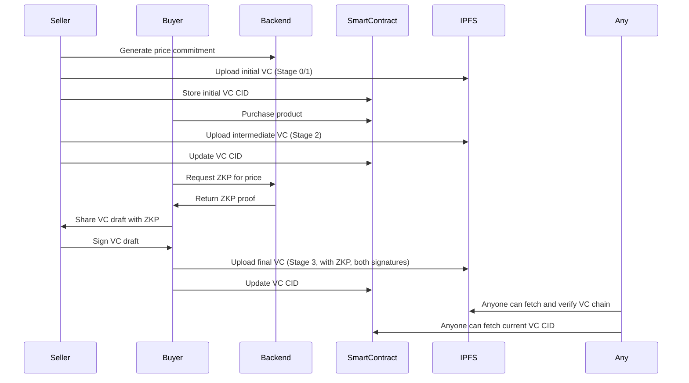
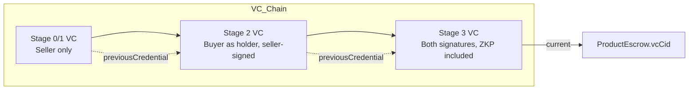
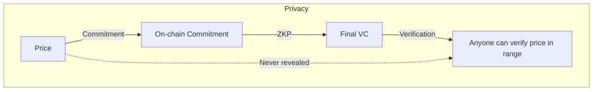

# ⚡️ EV Battery Supply Chain dApp — ZKP & VC Architecture

## Workflow Overview

---

## VC Chain Structure

---

## Privacy with ZKP

---

## How ZKP is Used

- **Pedersen Commitment:** Seller commits to the price at product creation (on-chain, not revealed).
- **ZKP (Bulletproofs):** At delivery, a ZKP is generated to prove the price is in an allowed range, without revealing it.
- **VC Inclusion:** The ZKP is included in the final VC, which is signed by both seller and buyer.
- **Verification:** Anyone can verify the ZKP and both signatures, but cannot learn the actual price.

---

## Auditability

- **VC chain is stored on IPFS, anchored on-chain via the latest CID.**
- **Each VC is signed (W3C-compliant `proof` array).**
- **ZKP is included in the final VC.**
- **Anyone can walk the VC chain, verify signatures, and check the ZKP.**

---

## Summary Table

| Stage         | VC Uploaded? | CID On-Chain? | ZKP Included? | Signatures         |
|---------------|:-----------:|:-------------:|:-------------:|:------------------:|
| Initial (0/1) |     Yes     |     Yes       |      No       | Seller             |
| Stage 2       |     Yes     |     Yes       |      No       | Seller             |
| Final (3)     |     Yes     |     Yes       |     Yes       | Seller + Buyer     |

---

**This architecture provides:**
- **Confidentiality:** Price is never revealed, only proven in range.
- **Auditability:** Full VC chain, signatures, and ZKP are all verifiable.
- **Compliance:** Uses W3C VC standards and best practices for ZKP integration. 